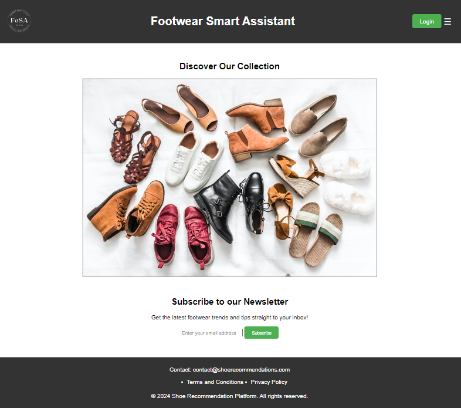
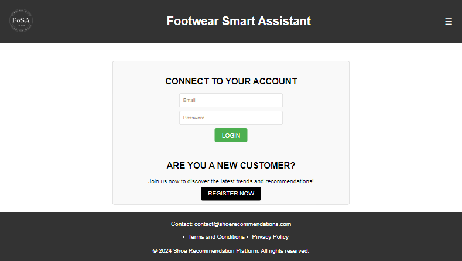
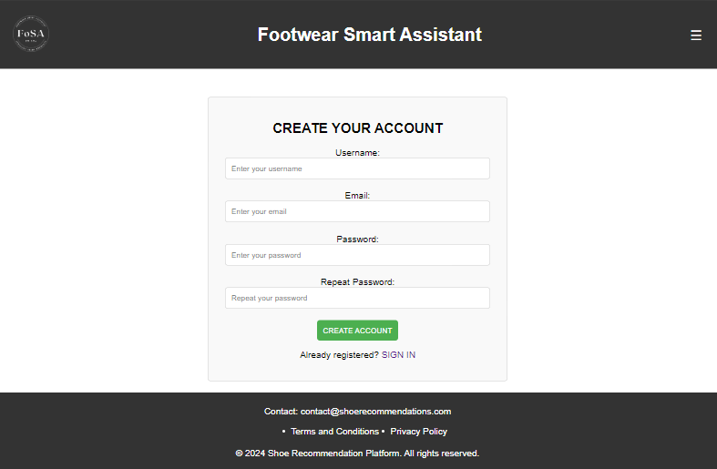
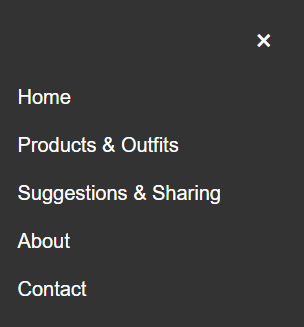
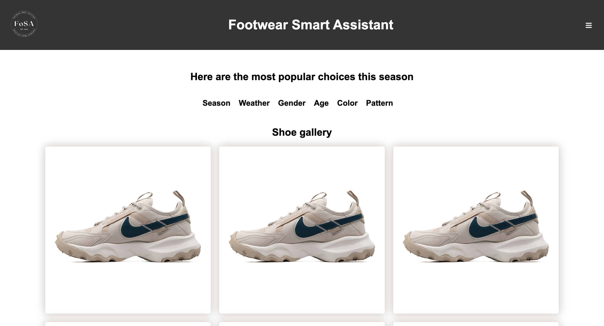
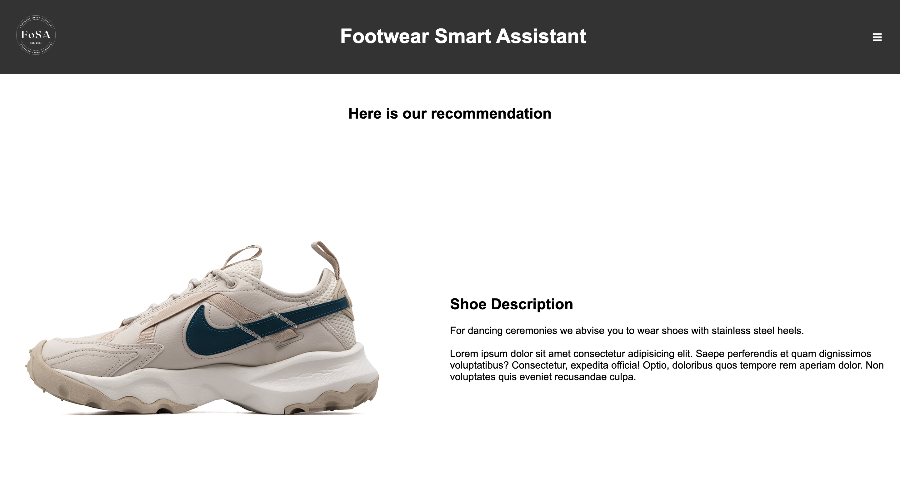
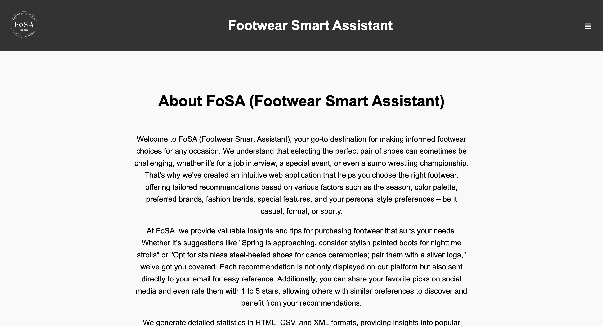
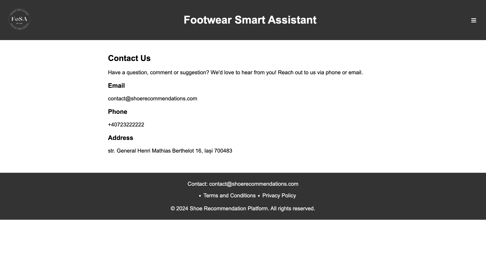

# IEEE-Tempate
IEEE System Requirements Specification Template

# Software Requirements Specification
<!-- ## For  <project name>
Version 1.0 approved
Prepared by <author> -->
<organization>
<date created>

Table of Contents
=================
  <!-- * [Revision History](#revision-history) -->
  * [Introduction](#1-introduction)
    * 1.1 [Purpose](#11-purpose)
    <!-- * 1.2 [Document Conventions](#12-document-conventions) -->
    * 1.2 [Intended Audience and Reading Suggestions](#12-intended-audience-and-reading-suggestions)
    * 1.3 [Product Scope](#13-product-scope)
    * 1.4 [References](#14-references)
  * [Overall Description](#overall-description)
    * 2.1 [Product Perspective](#21-product-perspective)
    * 2.2 [Product Functions](#22-product-functions)
    * 2.3 [User Classes and Characteristics](#23-user-classes-and-characteristics)
    * 2.4 [Operating Environment](#24-operating-environment)
    * 2.5 [Design and Implementation Constraints](#25-design-and-implementation-constraints)
    * 2.6 [User Documentation](#26-user-documentation)
    * 2.7 [Assumptions and Dependencies](#27-assumptions-and-dependencies)
  * [External Interface Requirements](#external-interface-requirements)
    * 3.1 [User Interfaces](#31-user-interfaces)
    * 3.2 [Hardware Interfaces](#32-hardware-interfaces)
    * 3.3 [Software Interfaces](#33-software-interfaces)
    * 3.4 [Communications Interfaces](#34-communications-interfaces)
  * [System Features](#system-features)
    * 4.1 [Home Page](#41-home-page)
    * 4.2 [Login Page](#42-login-page)
    * 4.3 [Register Page](#43-register-page)
    * 4.4 [Filter Page](#44-filter-page)
    * 4.5 [Shoe Page](#45-shoe-page)
    * 4.6 [About Page](#46-about-page)
    * 4.7 [Contact Page](#47-contact-page)

  * [Other Nonfunctional Requirements](#other-nonfunctional-requirements)
    * 5.1 [Performance Requirements](#51-performance-requirements)
    * 5.2 [Safety Requirements](#52-safety-requirements)
    * 5.3 [Security Requirements](#53-security-requirements)
    * 5.4 [Software Quality Attributes](#54-software-quality-attributes)
    * 5.5 [Business Rules](#55-business-rules)
  * [Other Requirements](#other-requirements)
* [Appendix A: Glossary](#appendix-a-glossary)
* [Appendix B: Analysis Models](#appendix-b-analysis-models)
* [Appendix C: To Be Determined List](#appendix-c-to-be-determined-list)

<!-- ## Revision History
| Name | Date    | Reason For Changes  | Version   |
| ---- | ------- | ------------------- | --------- |
|      |         |                     |           |
|      |         |                     |           |
|      |         |                     |           | -->

## 1. Introduction
### 1.1 Purpose 
The purpose of this document is to present a description of the web application Footwear Smart Assistant based on the project FoSA. It will explain the purpose and features of the application, the interface of the software, what it will do and the constraints under which it must operate. This document is intended for any potential users of the software.
<!-- ### 1.2 Document Conventions
Describe any standards or typographical conventions that were followed when writing this SRS, such as fonts or highlighting that have special significance. For example, state whether priorities  for higher-level requirements are assumed to be inherited by detailed requirements, or whether every requirement statement is to have its own priority. -->
### 1.2 Intended Audience and Reading Suggestions
This document is intended for any user that might wish to use the Footwear Smart Assistant web application.
### 1.3 Product Scope
Footwear Smart Assistant has been developed with the intended purpose of being an interactive webpage for the general internet users.
### 1.4 References
[IEEE Template for System Requirements Specification Documents](https://github.com/rick4470/IEEE-SRS-Tempate/blob/master/README.md#12-document-conventions)

[Figma: The Collaborative Interface Design Tool](https://www.figma.com/)

[FoSA (Footwear Smart Assistant)](https://github.com/Sarghe-Andrei-Vlad/TW)

## Overall Description
### 2.1 Product Perspective
The Footwear Smart Assistant website is based on the FoSA project. It is an online website meant for people who wish to look for specific or non-specific footwear in an interactive way. Users can choose to see our recommended footwear or choose their own shoes based on a list of filters provided by the website.
### 2.2 Product Functions
The pages within the website are designed as follows:

Home Page (index) - central point of navigation to the rest of the pages within the website
    • logo: our logo, redirects to the homepage

    • title: redirects to the homepage

    • login button: redirects to the login page

    • sidemenu: pulls out a menu containing the home, products, about and contact pages.

    • home: redirects to the home page

    • products & outfits: redirects to the filters page

    • about: redirects to the about page

    • contact: redirects to the contact page

    • subscribe email input: adds you to our list of subscribers for our newsletter if your email is valid

Login Page
    • logo: our logo, redirects to the homepage

    • title: redirects to the homepage

    • sidemenu: pulls out a menu containing the home, products, about and contact pages.

    • email input: accepts the email of the user

    • password input: accepts the password of the user

    • login: finalizes the login action, logging the user in if the credentials are correct, and then redirects them to the home page

    • register: redirects to the register page

Register Page
    • logo: our logo, redirects to the homepage

    • title: redirects to the homepage

    • sidemenu: pulls out a menu containing the home, products, about and contact pages.

    • username input: accepts the username of the user

    • email input: accepts the email of the user

    • password input: accepts the password of the user

    • confirm password input: checks that the two passwords match.

    • create aaccount button: finalizes the register action, registering the user in if the credentials are correct, and then redirects them to the home page

    • Sign in button: redirects to the login page

Filter Page - allows users to get the best footwear recommendations based on specific criteria or needs
    • logo: our logo, redirects to the homepage

    • title: redirects to the homepage

    • sidemenu: pulls out a menu containing the home, products, about and contact pages.

    • home: redirects to the home page

    • products & outfits: redirects to the filters page

    • about: redirects to the about page

    • contact: redirects to the contact page

    • logout button: redirects to the homepage

    • season filter: opens a dropdown menu with multiple season options, allowing users to select one or more seasons for filtering footwear options

    • weather filter: opens a dropdown menu with multiple weather options, allowing users to select one or more weather conditions for filtering footwear options

    • gender filter: opens a dropdown menu with multiple gender options, allowing users to select one or more genders for filtering footwear options

    • age filter: opens a dropdown menu with multiple age group options, allowing users to select one or more age groups for filtering footwear options

    • color filter: opens a dropdown menu with multiple color options, allowing users to select one or more colors for filtering footwear options

    • pattern filter: opens a dropdown menu with multiple pattern options, allowing users to select one or more patterns for filtering footwear options

    • shoe images: redirect to the specified shoe page

Shoe Page - provides detailed information about a specific shoe, including its photo, description, and any special features
    • logo: our logo, redirects to the homepage

    • title: redirects to the homepage

    • sidemenu: pulls out a menu containing the home, products, about and contact pages

    • home: redirects to the home page

    • products & outfits: redirects to the filters page

    • about: redirects to the about page

    • contact: redirects to the contact page

    • logout button: redirects to the homepage

    • review input: accepts the review of the user

    • name input: accepts the name of the user

    • rating dropdown: selects the rating of the user

    • submit review: finalizes the review action, allowing users to submit their feedback and comments about the footwear product

About Page - provides information about a the shoe recommendation platform, including its mission and vision

Contact Page - provides the contact information of the platform (email, phone number and address)
### 2.3 User Classes and Characteristics
Casual Users: Infrequent users who primarily browse or search for products with basic technical skills and no special privileges.

Registered Users: Moderate to frequent users who utilize advanced features like writing reviews, with standard user privileges.

Administrators: Daily users responsible for site management and maintenance, possessing the highest privilege levels and technical expertise.
### 2.4 Operating Environment
The developed product can be used on any device with a connection to the Internet and a browser installed.
### 2.5 Design and Implementation Constraints
The development of the Footwear Smart Assistant (FoSA) website is subject to the following constraints:

- Corporate/Regulatory Policies: Compliance with GDPR for data protection.
- Hardware Limitations: Ensuring responsive performance across various devices with differing hardware capabilities, including timing and memory requirements.
- Specific Technologies and Tools: Use of Node.js for server-side development, MySQL2 for database management, and HTML, CSS (Sass) for front-end development.
- Parallel Operations: Supporting concurrent user interactions without performance degradation.
- Language Requirements: English as the primary language with potential support for multiple languages for international users.
- Communications Protocols: Use of HTTPS for secure data transmission.
- Security Considerations: Implementation of robust authentication mechanisms using public and private keys, and encryption for data protection.
- Design Conventions: Adherence to industry-standard coding practices and design conventions to ensure maintainability and scalability of the codebase.
### 2.6 User Documentation
The Footwear Smart Assistant (FoSA) website will include the following user documentation components:

- User Manuals: Comprehensive guides detailing the features and functionalities of the website.
- Online Help: Context-sensitive help available within the website to assist users with immediate questions and issues.

These documentation components will be delivered in digital formats such as PDF and accessible web pages, adhering to standard documentation practices to ensure ease of use and accessibility.
### 2.7 Assumptions and Dependencies
The development of the Footwear Smart Assistant (FoSA) website is based on the following assumptions and dependencies:

- Assumptions:

Users will have reliable internet access and use modern web browsers.
The development team will have access to necessary development and testing tools.

- Dependencies:

Dependence on MySQL for database management and its availability.
Reliance on external libraries such as Node.js and Sass for development.
These factors could impact the project if assumptions prove incorrect or dependencies change.
## External Interface Requirements
### 3.1 User Interfaces

### 3.2 Hardware Interfaces
The Footwear Smart Assistant (FoSA) website interacts with various hardware components to deliver a seamless user experience.

1. Supported Device Types:

The FoSA website supports a wide range of device types to ensure accessibility and usability across different platforms. The supported devices include:

- Desktop Computers: Includes devices running on Windows, macOS, and Linux operating systems.
- Laptops: Includes devices running on Windows, macOS, and Linux operating systems.
- Tablets: Includes devices running on iOS, Android, and Windows operating systems.

2. Logical Characteristics:

- Responsive Design: The website uses responsive web design techniques to adapt to different screen sizes and resolutions, ensuring a consistent user experience across all device types.
- Web Browsers: The website supports major web browsers, including Google Chrome, Mozilla Firefox, Microsoft Edge, and Opera. Compatibility is ensured through thorough testing and adherence to web standards.
- User Interaction: Input methods include mouse and keyboard for desktops and laptops, and touch input for tablets and smartphones. The website's interface adjusts accordingly to provide optimal usability.

3. Physical Characteristics:

- Server-Side Components:

Web Server: The website is hosted on a web server that handles HTTP/HTTPS requests and serves web pages to users. It uses Node.js to manage server-side logic and interactions with the database.

Database Server: A MySQL database server stores all the footwear, user, reviews, and statistics data. The database server communicates with the Node.js application through the MySQL2 library.

- Client-Side Components:

User Devices: The website is accessed via web browsers on user devices. The client-side code, written in HTML, CSS (and Sass), and JavaScript, runs on these devices to render the web pages and handle user interactions.

- Data and Control Interactions:

Data Requests: Users' actions, such as searching for footwear or applying filters, generate data requests sent from the client-side to the server-side. These requests are processed by Node.js, which interacts with the MySQL database to fetch or update data.

Data Responses: The server responds with the requested data or confirmation of data updates, which the client-side code then uses to update the user interface dynamically.

Security Protocols: Communication between user devices and the web server is secured using HTTPS, ensuring data integrity and confidentiality. The use of public and private keys for user authentication further enhances security.

4. Communication Protocols

- HTTP/HTTPS: The primary communication protocol for interactions between user devices and the web server. HTTPS is used to encrypt data transmitted over the network.

- Database Connectivity: The Node.js application communicates with the MySQL database using the MySQL2 library, which provides a reliable and efficient interface for database operations.
### 3.3 Software Interfaces
The minimum software requirements of Footwear Smart Assistant are a working browser and a connection to the Internet.
### 3.4 Communications Interfaces
Footwear Smart Assistant requires an Internet connection. The communication standard to be used is HTTP.
## System Features
### 4.1 Home Page
Users can login into their acoount, navigate to all other pages and subscribe to our newsletter.
### 4.2 Login Page
Users of our website can login by entering their credentials or register if they do not have an account and navigate to other pages from this page.
### 4.3 Register Page
Guests can create an account and then use it to log into the application and access all the features it provides and navigate to other pages from this page.
### 4.4 Filter Page
Users can get the best footwear recommendations based on specific criteria. They can select the filters that match their needs and navigate to other pages from this page.
### 4.5 Shoe Page
Users can get detailed information about a specific shoe, including its photo, description, and any special features. They can review the recommendation and also navigate to other pages from this page.
### 4.6 About Page
Users can get information about a the shoe recommendation platform, including its mission and vision and navigate to other pages from this page.
### 4.7 Contact Page
Users can get the contact information of the platform (email, phone number and address) and navigate to other pages from this page.
## Other Nonfunctional Requirements
### 5.1 Performance Requirements
The Footwear Smart Assistant (FoSA) website is designed to meet the following performance requirements:

Response Time: The website loads the homepage within 3 seconds under normal network conditions, ensuring a smooth user experience.

Search Functionality: Searches for footwear using filters return results within 2 seconds, allowing users to quickly find what they are looking for.

Data Processing: User inputs and interactions (e.g., applying filters) are processed and updated on the front-end within 3 second, providing immediate feedback to users.

Scalability: The system scales to accommodate increased user load, maintaining the performance standards specified above.
These requirements ensure that the website delivers a responsive and efficient user experience, even under varying conditions.
### 5.2 Safety Requirements
The FoSA website addresses the following safety requirements:

Data Protection: User data, including personal information and preferences, is protected against loss or unauthorized access through robust security measures.

Transaction Safety: User registration and login processes are safeguarded with encryption to prevent interception and unauthorized access.

Regulatory Compliance: The website complies with relevant regulations such as GDPR for data protection and privacy, ensuring that user data is handled responsibly.

Error Handling: The system handles errors gracefully, providing user-friendly error messages and logging errors for administrative review, minimizing user disruption and aiding in troubleshooting.

These safety measures help create a secure and trustworthy environment for users interacting with the website.
### 5.3 Security Requirements
The FoSA website incorporates the following security requirements:

Authentication: Users authenticate using a combination of a public key and a private key during login and registration, ensuring secure access.

Data Encryption: All sensitive data, including user credentials and personal information, is encrypted both in transit and at rest, protecting against data breaches.

Access Control: Different user roles (e.g., admin, registered user) have appropriate access controls, ensuring they can only perform actions authorized for their role.

Regular Audits: Security audits are conducted regularly to identify and fix vulnerabilities, maintaining a high level of security.

Compliance: The website meets security standards outlined in regulations such as GDPR for handling user data, ensuring comprehensive data protection.

These security measures help protect user information and maintain the integrity of the system.
### 5.4 Software Quality Attributes
The FoSA website maintains the following software quality attributes:

Usability: The interface is intuitive and easy to navigate, providing a user-friendly design that enhances the user experience.

Reliability: The system achieves an uptime of at least 99.9%, ensuring it is available to users almost all the time, enhancing reliability.

Maintainability: The codebase is modular and well-documented, facilitating easy maintenance and updates.

Scalability: The system handles increased load without significant performance degradation, ensuring consistent functionality.

These quality attributes ensure that the website is functional, user-friendly, and easy to manage for developers.
### 5.5 Business Rules
The FoSA website operates under the following business rules:

User Roles: Only registered users can add reviews, while all users can use the search and filter functionalities, defining user capabilities.

Content Management: Admins update the database with new footwear and outfit options, maintaining the freshness of the inventory.

Review Moderation: Admins moderate user reviews to remove inappropriate content, ensuring a positive user community.

These business rules define the operational framework within which the website functions, ensuring clarity and consistency in user interactions.
## Other Requirements
Other pertinent requirements for the FoSA website include:

Database Requirements: The database is a MySQL database, using the MySQL2 library for Node.js, and is optimized for fast read and write operations, ensuring efficient data handling.

Legal Requirements: The website complies with international laws regarding e-commerce and online user interactions, including accessibility standards, ensuring legal compliance.

Reuse Objectives: The project develops reusable components that can be easily integrated into other projects or future versions of the website, promoting efficient development practices.
### Appendix A: Glossary
FoSA: Footwear Smart Assistant

GDPR: General Data Protection Regulation

HTML: HyperText Markup Language

CSS: Cascading Style Sheets

Sass: Syntactically Awesome Style Sheets

Node.js: A JavaScript runtime built on Chrome's V8 JavaScript engine

MySQL: An open-source relational database management system
<!-- ### Appendix B: Analysis Models
To be reviewed...

Optionally, include any pertinent analysis models, such as data flow diagrams, class diagrams, state-transition diagrams, or entity-relationship diagrams. -->
### Appendix B: To Be Determined List
- TBD-001: Finalize the list of supported languages for internationalization.

- TBD-002: Determine the detailed design for user authentication flow.
